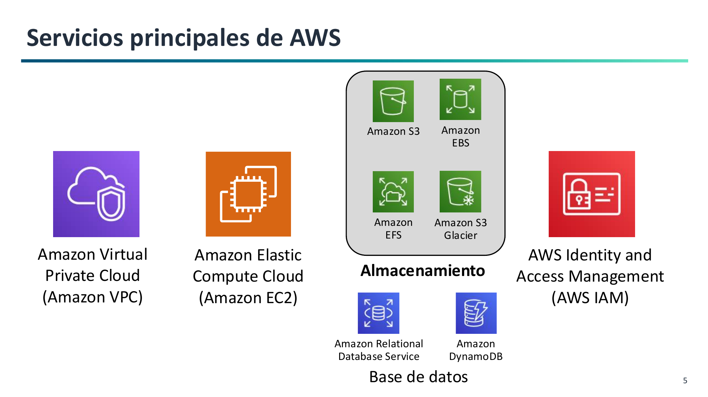
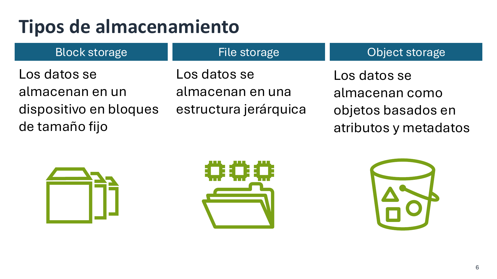
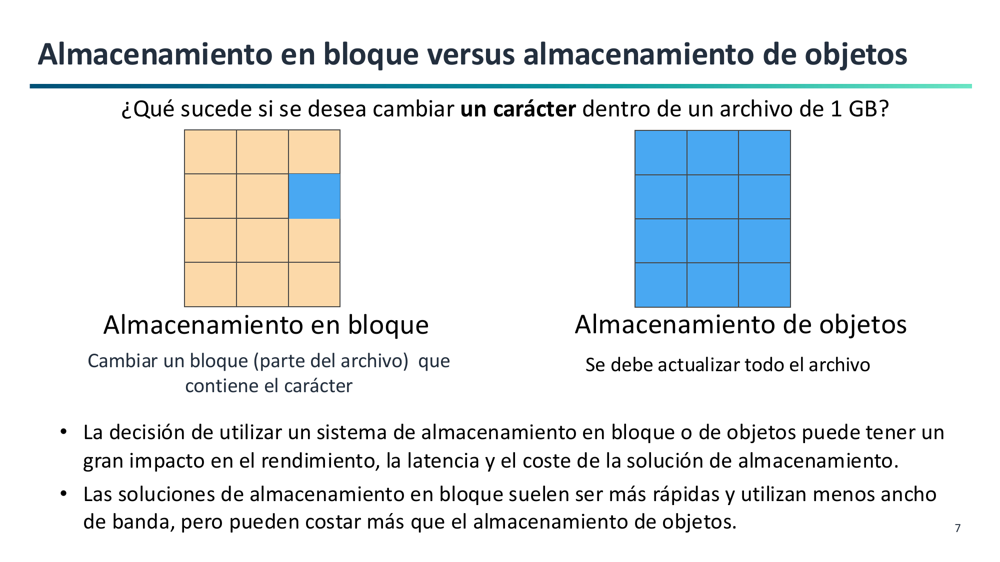

# 1. Introducción al Almacenamiento en la Nube y Almacenamiento de Objetos

El almacenamiento es uno de los pilares esenciales de la nube, junto con el cómputo y las redes. Seleccionar el tipo de almacenamiento adecuado según requisitos de durabilidad, coste, latencia y patrones de acceso es el objetivo principal del **Resultado de Aprendizaje 1 (RA1)**.

---

## El Ecosistema de Servicios de AWS

Dentro del mapa global de servicios de Amazon Web Services, el almacenamiento interactúa de forma constante con los servicios de cómputo, redes, bases de datos y seguridad:

- **Cómputo:** Instancias virtuales (**Amazon EC2**) y funciones sin servidor (**AWS Lambda**).
- **Redes:** Aislamiento y control de tráfico con **Amazon Virtual Private Cloud (VPC)**.
- **Seguridad:** Control granular de identidades, usuarios y roles mediante **AWS Identity and Access Management (IAM)**.
- **Bases de datos:** Servicios relacionales (**Amazon RDS**) y clave-valor (**Amazon DynamoDB**).
- **Almacenamiento:** Soluciones en bloque (**EBS**), archivos en red (**EFS**) y objetos (**S3** y **Glacier**).

---

## Tipos de Almacenamiento en la Nube

AWS clasifica el almacenamiento en tres modelos arquitectónicos bien diferenciados:

1. **Almacenamiento en Bloque (Amazon EBS):**
    - Expone volúmenes de disco crudos divididos en bloques de tamaño fijo (ej. 4 KB).
    - El sistema operativo anfitrión le da formato (`ext4`, `xfs`, `NTFS`).
    - Muy baja latencia (sub-milisegundo), conectado directamente a una instancia EC2.
    - **Caso típico:** Discos de sistema operativo y bases de datos transaccionales (OLTP).

2. **Almacenamiento de Ficheros (Amazon EFS / Amazon FSx):**
    - Sistema jerárquico tradicional de carpetas y ficheros.
    - Se monta en red mediante protocolos estándar (**NFSv4** para Linux o **SMB** para Windows).
    - Acceso concurrente de cientos de máquinas a los mismos archivos.
    - **Caso típico:** Servidores de ficheros corporativos y sistemas CMS compartidos.

3. **Almacenamiento de Objetos (Amazon S3):**
    - Repositorio plano (*flat namespace*) donde los datos se almacenan como **objetos**.
    - Cada objeto tiene sus datos binarios (*payload*), una clave única (*Key*) y metadatos descriptivos.
    - Acceso universal mediante **API REST sobre HTTP/HTTPS**.
    - **Caso típico:** Copias de seguridad, lagos de datos (*Data Lakes*), sitios web estáticos y ficheros multimedia.

!!! tip "¿Cómo entender la diferencia entre ficheros y objetos?"
    - **Un sistema de archivos tradicional** es como un **archivador de oficina con carpetas y subcarpetas**: para encontrar un papel necesitas la ruta jerárquica exacta (`/año/mes/factura.pdf`). Si alguien renombra una carpeta intermedia, se rompen los enlaces.
    - **Un almacén de objetos como S3** funciona como el **guardarropa de un teatro**: entregas tu abrigo (los datos), le colocan una etiqueta con metadatos (color, propietario) y te entregan una ficha única (la clave o ID). No necesitas saber en qué percha física cuelgan tu abrigo; al presentar tu ficha, te devuelven el objeto exacto de forma instantánea.

---

## Comparativa Técnica

| Característica | Bloque (EBS) | Ficheros (EFS / FSx) | Objetos (S3) |
| :--- | :--- | :--- | :--- |
| **Unidad mínima** | Bloque de tamaño fijo | Fichero en árbol jerárquico | Objeto discreto (Datos + Metadatos) |
| **Identificador** | Dirección lógica (LBA) | Ruta jerárquica (`/var/log/...`) | Clave única dentro del bucket (`URI`) |
| **Protocolo** | NVMe / iSCSI / canal local | NFS / SMB en red | API REST (HTTP / HTTPS) |
| **Latencia** | Sub-milisegundo | Pocos milisegundos | Decenas de milisegundos |
| **Escalabilidad** | Hasta el tamaño del volumen | Elástica (Petabytes) | Prácticamente ilimitada |
| **Coste por GB** | Alto | Medio-Alto | **Muy bajo** |
| **Modificación parcial**| **Sí** (sobrescribe sectores) | **Sí** (modifica bytes) | **No** (reescritura completa) |

---

## Casos de Uso del Almacenamiento en AWS

Una regla práctica para elegir el servicio idóneo según la necesidad del proyecto:

| Si tu proyecto necesita... | Piensa en utilizar... |
| :--- | :--- |
| Almacenamiento de disco rápido y persistente para instancias EC2 o bases de datos relacionales | **Amazon Elastic Block Store (Amazon EBS)** |
| Una plataforma elástica, duradera y de bajo coste accesible vía web para backups, web estática o multimedia | **Amazon Simple Storage Service (Amazon S3)** |
| Archivado a muy largo plazo y custodia legal con el coste más bajo posible | **Amazon S3 Glacier** |
| Un sistema de ficheros compartido accesible por múltiples servidores Linux mediante red NFS | **Amazon Elastic File System (Amazon EFS)** |

---

## El Principio de Inmutabilidad en Objetos

Los objetos en Amazon S3 son tratados como **entidades atómicas e inmutables**:

!!! warning "¿Qué ocurre al modificar un único carácter en un archivo de 1 GB?"
    - **En Bloque (EBS):** El sistema operativo solo sobrescribe el bloque de 4 KB donde está ese carácter. El resto de bloques no se tocan.
    - **En Objetos (S3):** No se puede modificar un byte *in-place*. Es necesario **volver a subir el archivo completo de 1 GB**, reemplazando la versión anterior.

Por este motivo, S3 está optimizado para el patrón **WORM** (*Write Once, Read Many*): escribir una vez y leer millones de veces.
