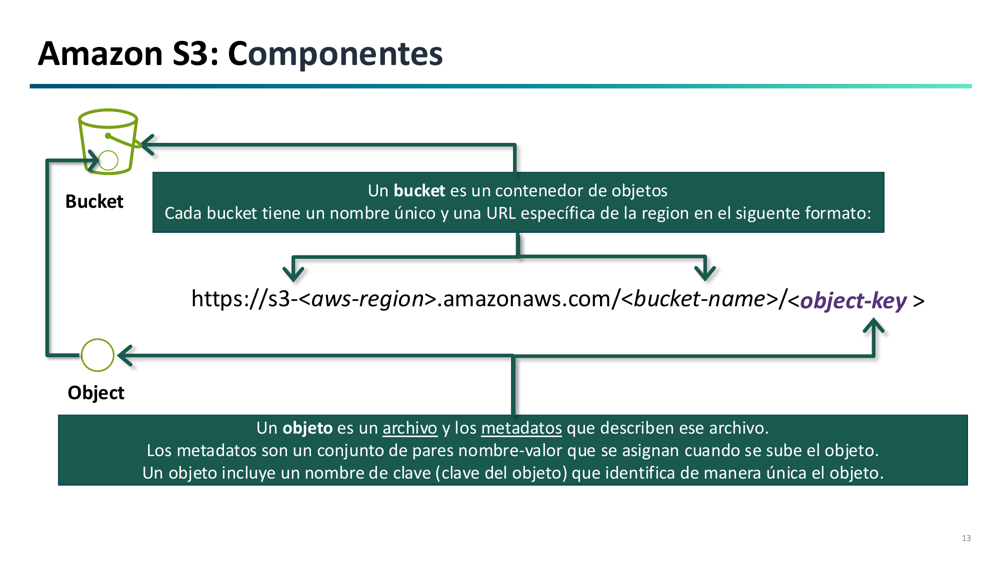
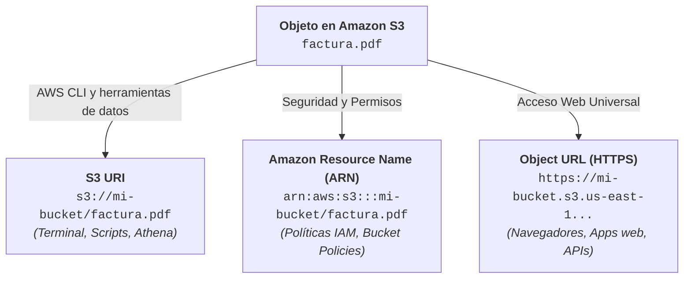
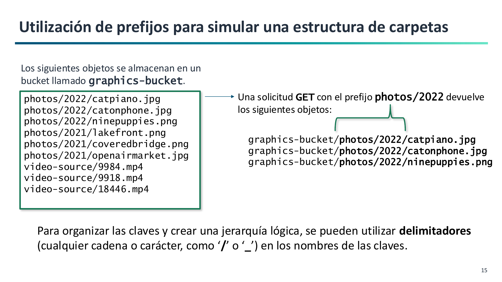
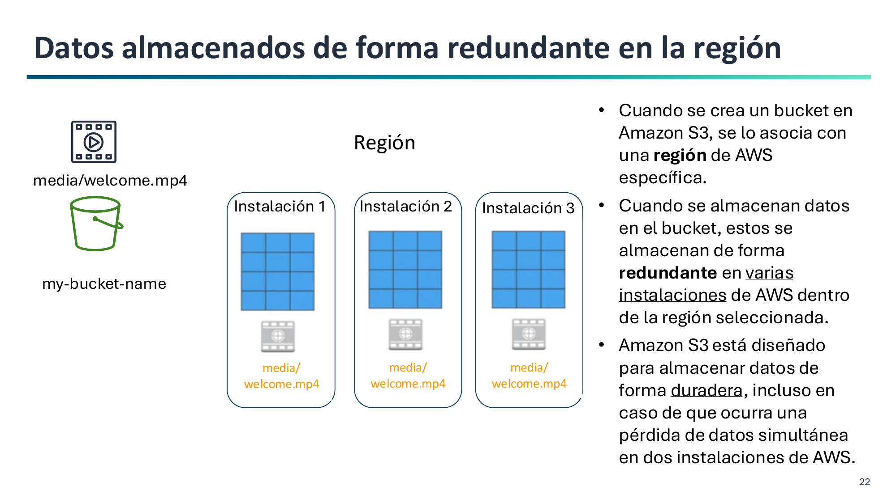
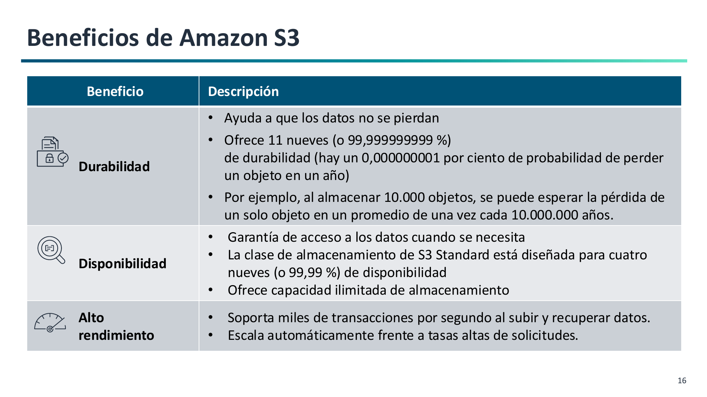
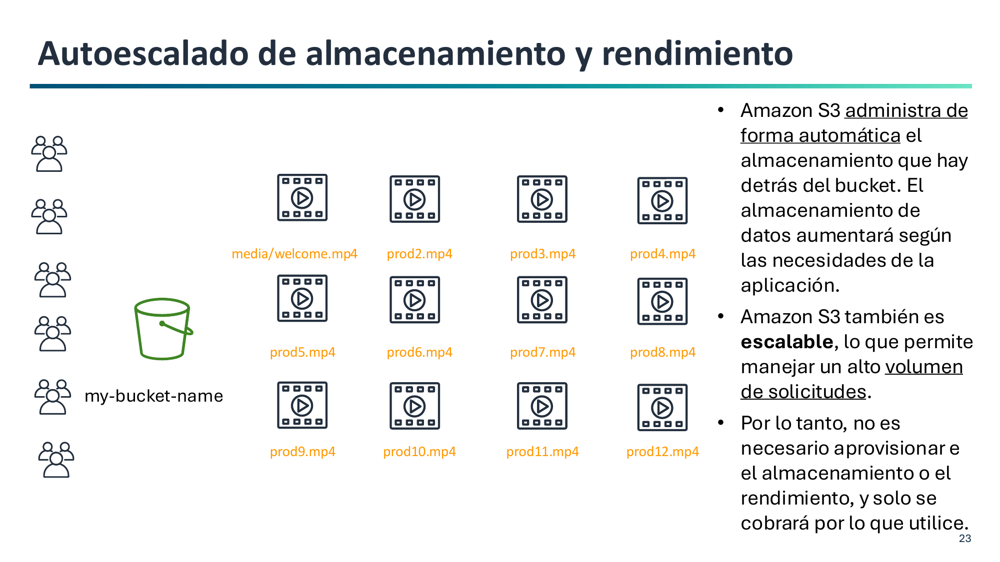
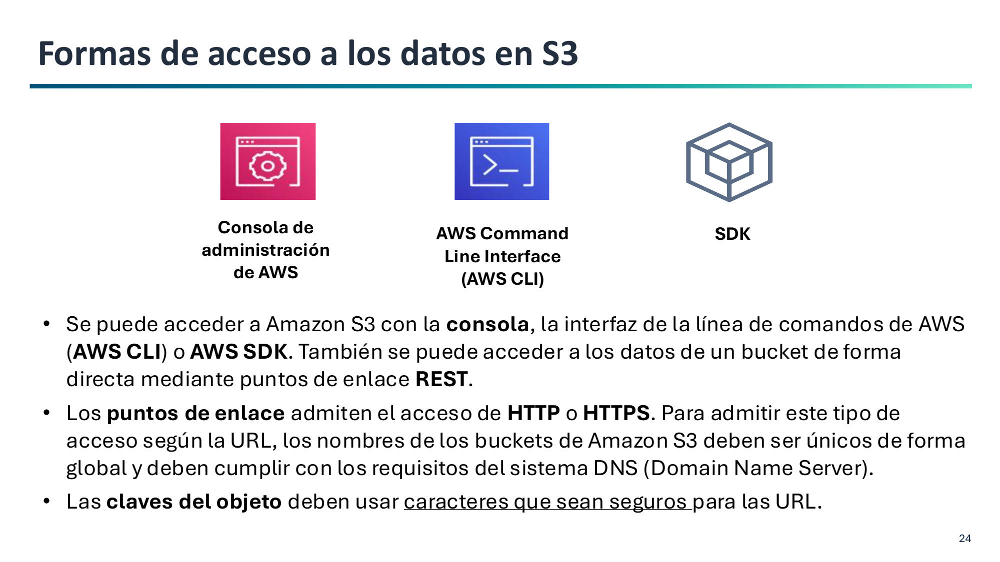

# 2. Arquitectura y Componentes de Amazon S3

Amazon Simple Storage Service (Amazon S3) es un servicio de almacenamiento de objetos gestionado a nivel global que garantiza una durabilidad del **99,999999999% (11 nueves)** y escalabilidad automática.

---

## Componentes Fundamentales: Buckets y Objetos

La arquitectura de S3 se compone de dos conceptos centrales:

### 1. Buckets (Contenedores)
Un **bucket** es el contenedor raíz de objetos en S3.

- **Reglas de denominación DNS:**
    - Longitud entre **3 y 63 caracteres**.
    - Solo admite **minúsculas**, **números** y **guiones** (`-`).
    - No puede contener mayúsculas, espacios, subrayados (`_`) ni tener formato de dirección IP (`192.168.1.1`).

!!! note "Espacios de Nombres en S3: Global vs. Account Regional"
    Al crear un bucket de propósito general (*General Purpose Bucket*), AWS ofrece dos modalidades de espacio de nombres (*namespace*):

    - **Shared Global Namespace (Tradicional / Por defecto):**
        - El nombre debe ser único en **todo el mundo** entre todas las cuentas de AWS. Si otra persona u organización ya lo ha registrado, no estará disponible.
        - Es el formato estándar utilizado habitualmente y el que emplearemos en nuestros laboratorios asignando prefijos personales (ej. `abdan-tunombre-lab1`).
    - **Account Regional Namespace (Novedad 2026 / Recomendado en producción):**
        - El nombre queda reservado **exclusivamente para tu ID de cuenta de AWS en esa región**, eliminando cualquier riesgo de colisión con otros clientes de AWS.
        - Sigue la convención obligatoria: `{prefijo}-{id-cuenta}-{region}-an` (ej. `backups-123456789012-eu-west-1-an`).
        - Simplifica el despliegue con Infraestructura como Código (IaC con Terraform o CloudFormation) y protege contra la ocupación maliciosa o accidental de nombres (*name squatting*).

### 2. Región Geográfica
Al crear el bucket se elige obligatoriamente la **región de AWS** donde residirán físicamente los datos.

- **Residencia de datos (RGPD):** Para cumplir con normativas de protección de datos personales de la UE, se eligen regiones europeas (como España `eu-south-2` o Irlanda `eu-west-1`).
- **Latencia y coste:** Seleccionar la región más cercana a los usuarios y verificar las tarifas por GB de cada región.

---

## Estructura de un Objeto

Cada objeto almacenado en S3 consta de:

- **Clave (Key):** El identificador o nombre único del objeto dentro del bucket (hasta 1.024 bytes). Ejemplo: `fotos/2026/portada.jpg`.
- **Valor (Value):** El contenido binario del archivo (desde 0 bytes hasta 5 TB).
- **ID de Versión:** Cadena que identifica la versión cuando el versionado está activo.
- **Metadatos:** Información descriptiva del objeto.

!!! tip "La analogía del libro para los Metadatos"
    En un libro, el texto de las páginas representa los **datos puros (Value)**, mientras que el título, el autor, el ISBN, la editorial y la fecha de publicación representan los **metadatos**: permiten identificar, catalogar y buscar la información sin necesidad de leer todo el libro.

    - **Metadatos del sistema:** Asignados por AWS (`Content-Type`, `Content-Length`, `Last-Modified`, `ETag`).
    - **Metadatos de usuario:** Pares clave-valor personalizados (`x-amz-meta-departamento: contabilidad`).

---

## Identificadores de un Objeto: S3 URI, ARN y Object URL

En la consola de Amazon S3, al seleccionar cualquier archivo, AWS ofrece tres formas distintas de identificarlo y referenciarlo. Cada formato responde a un propósito y ámbito de uso diferente:

### 1. S3 URI (*Uniform Resource Identifier*)
Identificador nativo utilizado internamente por las herramientas del ecosistema de AWS.

- **Sintaxis:** `s3://<nombre-bucket>/<clave-objeto>`
- **Ejemplo:** `s3://abdan-dortega-lab1/documentos/factura.pdf`
- **¿Dónde se utiliza?**
    - En la **AWS CLI**: es la dirección obligatoria en comandos de copia, sincronización y listado (`aws s3 cp`, `aws s3 sync`, `aws s3 ls`).
    - En servicios de análisis y procesamiento de datos (Amazon Athena, AWS Glue, EMR).
    - En scripts de automatización con Python y SDKs (`boto3`).
    - *Nota:* Solo es comprensible por herramientas que integran las librerías de AWS; **un navegador web no sabe resolver el protocolo `s3://`**.

### 2. Amazon Resource Name (ARN)
Identificador unívoco universal que utiliza el motor de seguridad y gestión de identidades de AWS (**IAM**).

- **Sintaxis:**
    - Para un bucket completo: `arn:aws:s3:::<nombre-bucket>`
    - Para un objeto específico: `arn:aws:s3:::<nombre-bucket>/<clave-objeto>`
    - Para todos los objetos de un bucket (comodín): `arn:aws:s3:::<nombre-bucket>/*`
- **Ejemplo:** `arn:aws:s3:::abdan-dortega-lab1/*`
- **¿Dónde se utiliza?**
    - En las directivas de seguridad dentro de las **Políticas de IAM** y las **Políticas de Bucket (*Bucket Policies*)**, específicamente en la sección `"Resource": [...]`.
    - En la configuración de roles, eventos y auditorías de seguridad.
    - *Nota:* No se utiliza para descargar ni manipular archivos, sino para definir **quién tiene permiso** para acceder a ellos. Los triples dos puntos (`:::`) reflejan que en los buckets globales se omiten la región y el identificador de cuenta.

### 3. Object URL (*Dirección Web HTTPS*)
Dirección web estándar accesible a través del protocolo HTTPS seguro.

- **Sintaxis:** `https://<nombre-bucket>.s3.<region>.amazonaws.com/<clave-objeto>`
- **Ejemplo:** `https://abdan-dortega-lab1.s3.us-east-1.amazonaws.com/documentos/factura.pdf`
- **¿Dónde se utiliza?**
    - En **navegadores web**: para descargar o visualizar directamente el archivo desde internet.
    - En aplicaciones web o móviles: para incrustar recursos en código HTML (``) o consumir ficheros mediante llamadas REST `GET`.
    - *Nota:* Para que un usuario pueda abrir esta URL en su navegador sin recibir un error `403 Forbidden`, el bucket u objeto deben haberse configurado con acceso público o el enlace debe generarse como una **URL prefirmada (*Presigned URL*)** temporal.

### Tabla Comparativa de Identificadores

| Identificador | Protocolo / Prefijo | Ámbito de uso principal | ¿Se puede abrir en un navegador? |
| :--- | :--- | :--- | :---: |
| **S3 URI** | `s3://` | Comandos de terminal (**AWS CLI**), scripts y analítica de datos | **No** (solo clientes AWS) |
| **ARN** | `arn:aws:s3:::` | Seguridad y permisos en **Políticas de IAM** y Bucket Policies | **No** (solo para reglas de control de acceso) |
| **Object URL** | `https://` | Acceso web directo, clientes HTTP, aplicaciones frontend y descargas | **Sí** (si los permisos lo autorizan) |

---

## Espacio de Nombres Plano y Simulación de Carpetas

A nivel interno, **S3 no tiene carpetas ni directorios reales**. Es un almacén plano de pares clave-valor.

- Cuando vemos `ventas/2026/factura.pdf`, la clave completa del objeto es esa cadena de texto íntegra.
- La barra `/` actúa simplemente como un **delimitador lógico**.
- La consola web agrupa visualmente los objetos que comparten el mismo **prefijo (prefix)** para simular el aspecto de carpetas tradicionales.

---

## Durabilidad y Redundancia en la Región

Los objetos en las clases estándar de S3 se almacenan de forma redundante y síncrona en un **mínimo de 3 Zonas de Disponibilidad (AZs)** dentro de la región seleccionada:

- **Durabilidad de 11 nueves (99,999999999%):** Diseñado para tolerar la pérdida física de dos instalaciones completas de centros de datos.
- **Consistencia de datos:** Ofrece **consistencia fuerte de lectura tras escritura (*Strong Read-After-Write Consistency*)** para operaciones `PUT` y `DELETE` en todas las regiones de AWS.
- **Rendimiento por prefijo:** Cada prefijo dentro de un bucket soporta de forma nativa al menos **3.500 escrituras (PUT/POST/DELETE)** y **5.500 lecturas (GET/HEAD) por segundo**.

---

## Beneficios Principales de Amazon S3

Amazon S3 destaca en la nube por tres pilares fundamentales:

| Beneficio | Métrica / Garantía | Descripción técnica |
| :--- | :--- | :--- |
| **Durabilidad** | **11 nueves** (99,999999999%) | Diseñado para evitar la pérdida o corrupción de datos. Con una probabilidad de pérdida del 0,000000001% anual, al almacenar 10.000.000 de objetos estadísticamente se perdería uno cada 10.000 años. |
| **Disponibilidad** | **4 nueves** (99,99% en S3 Standard) | Garantía de tiempo de actividad del servicio para acceder a los datos en el momento en que se solicitan. |
| **Alto rendimiento** | Capacidad y transacciones elásticas | Permite almacenar un volumen ilimitado de datos y responder a miles de peticiones simultáneas por segundo en subida y descarga. |

!!! tip "Durabilidad vs. Disponibilidad: Un matiz conceptual clave"
    - **Durabilidad:** Garantiza que el archivo no se rompa, degrade ni pierda en los discos físicos (integridad y supervivencia del dato a largo plazo).
    - **Disponibilidad:** Garantiza que el servicio web esté en línea y responda en tiempo y forma a las solicitudes de los clientes.
    *Un objeto puede estar 100% a salvo y duradero en el centro de datos, pero temporalmente no disponible si una avería de red impide comunicar con el servidor.*

---

## Autoescalado de Almacenamiento y Rendimiento

Amazon S3 opera bajo una filosofía de almacenamiento sin servidor (*serverless storage*):

- **Almacenamiento elástico automático:** No es necesario planificar ni aprovisionar capacidad por adelantado. El espacio crece o decrece al ritmo de los archivos subidos o eliminados.
- **Rendimiento adaptable:** S3 escala automáticamente sus recursos de computación y red para digerir picos repentinos de tráfico sin saturarse.
- **Pago por uso estricto:** No existen cuotas fijas de entrada ni almacenamiento mínimo obligatorio; solo se factura por los gigabytes consumidos en cada instante y por las solicitudes ejecutadas.

---

## Formas de Acceso a los Datos en S3

Para interactuar con los recursos de S3, AWS proporciona distintas vías adaptadas a perfiles operativos, administrativos y de desarrollo:

1. **Consola de Administración de AWS (Web UI):**
    - Interfaz gráfica accesible desde el navegador.
    - Ideal para familiarizarse con los conceptos, realizar configuraciones visuales y explorar el contenido.

2. **AWS Command Line Interface (AWS CLI):**
    - Herramienta de terminal para automatizar tareas y administrar recursos mediante comandos y scripts.
    - Ofrece comandos de alto nivel (`aws s3`) y comandos de bajo nivel que mapean la API REST (`aws s3api`).
    - *Es la herramienta protagonista de la segunda mitad de la Práctica 1.1.*

3. **Kits de Desarrollo de Software (AWS SDKs):**
    - Bibliotecas nativas para lenguajes de programación como Python (`boto3`), Java, JavaScript/TypeScript, Go o C#.
    - Permite a las aplicaciones subir, transformar y leer objetos de S3 directamente desde el código fuente.

4. **Puntos de Enlace REST (HTTP / HTTPS Endpoints):**
    - Al ser un almacén web nativo, cada objeto cuenta con una dirección web directa (`https://<bucket-name>.s3.<region>.amazonaws.com/<clave-objeto>`).
    - Cualquier cliente HTTP puede ejecutar operaciones `GET`, `PUT` o `DELETE` mediante peticiones REST estándar.
    - Por esta razón, los nombres de bucket deben ser globalmente válidos para DNS y las claves de los objetos deben utilizar caracteres seguros para la web (*URL-safe*).
