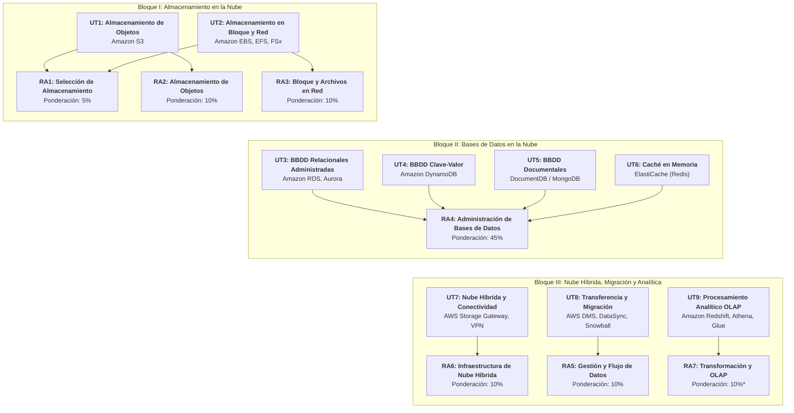

# Planificación y Programación del Módulo ABDAN

El módulo **Administración de Bases de Datos y Almacenamiento en la Nube** (ABDAN) del Curso de Especialización en Recursos y Servicios en la Nube se organiza a lo largo del curso académico en 9 Unidades de Trabajo (UT), diseñadas para asegurar la adquisición progresiva de los 7 Resultados de Aprendizaje oficiales.

---

## Mapa de Unidades de Trabajo y Resultados de Aprendizaje

### Resumen de Correspondencia entre Bloques, UTs y Resultados de Aprendizaje

| Bloque Formativo | Unidad de Trabajo (UT) | Servicios de Referencia en AWS | Resultado de Aprendizaje (RA) | Ponderación |
| :--- | :--- | :--- | :--- | :---: |
| **Bloque I: Almacenamiento en la Nube** | **UT1.** Almacenamiento de Objetos **UT2.** Almacenamiento en Bloque y Red | Amazon S3, S3 Glacier Amazon EBS, Amazon EFS, FSx | **RA1** (Selección de almacenamiento) **RA2** (Objetos S3) **RA3** (Bloque y Ficheros en red) | 5% 10% 10% |
| **Bloque II: Bases de Datos en la Nube** | **UT3.** BBDD Relacionales Gestionadas **UT4.** BBDD NoSQL Clave-Valor **UT5.** BBDD NoSQL Documentales **UT6.** Caché en Memoria | Amazon RDS, Aurora Amazon DynamoDB DocumentDB / MongoDB Atlas Amazon ElastiCache (Redis) | **RA4** (Administración Integral de Bases de Datos Gestionadas) | **45%** |
| **Bloque III: Nube Híbrida y Analítica** | **UT7.** Conectividad y Nube Híbrida **UT8.** Transferencia y Migración **UT9.** Procesamiento Analítico OLAP | AWS Storage Gateway, AWS Client VPN AWS DMS, AWS DataSync, Snowball Amazon Redshift, Athena, Glue | **RA6** (Infraestructura de Nube Híbrida) **RA5** (Flujo y Calidad del Dato) **RA7** (Transformación y Cargas OLAP) | 10% 10% 10%* |

---

## Detalle Curricular de las Unidades de Trabajo

### Bloque I: Almacenamiento en la Nube

#### UT1. Servicios de almacenamiento de objetos en la nube (Amazon S3)

- **Resultados de Aprendizaje asociados:** RA1 (Criterios a, b, c, d, e), RA2 (Criterios a, b, c, d, e, f, g, h).
- **Contenidos principales:**
    - Modelos de almacenamiento en la nube: Bloque, Fichero y Objeto.
    - Fundamentos de Amazon Simple Storage Service (S3): Buckets, objetos, prefijos y estructura plana.
    - Clases de almacenamiento (Standard, Intelligent-Tiering, Standard-IA, One Zone-IA, Glacier Instant/Flexible/Deep Archive, Express One Zone).
    - Gestión del ciclo de vida (Lifecycle Rules), control de versiones (Versioning) e inmutabilidad (S3 Object Lock / WORM).
    - Seguridad, control de acceso (Políticas IAM, Bucket Policies, Block Public Access) y cifrado en reposo (SSE-S3, SSE-KMS, SSE-C) y en tránsito.
    - Alojamiento de sitios web estáticos en S3.
    - Replicación de datos (CRR y SRR) y carga multiparte (Multipart Upload).
    - Administración programática con AWS CLI y el SDK para Python (`boto3`).

#### UT2. Servicios de almacenamiento en bloque y sistemas de ficheros en red (Amazon EBS, EFS, FSx)

- **Resultados de Aprendizaje asociados:** RA1, RA3.
- **Contenidos principales:**
    - Almacenamiento en bloque con Amazon Elastic Block Store (EBS): tipos de volúmenes (gp3, io2, st1, sc1), rendimiento (IOPS y Throughput), instantáneas (Snapshots) y ciclo de vida de instantáneas (Data Lifecycle Manager).
    - Sistemas de ficheros compartidos en red con Amazon Elastic File System (EFS) para Linux (NFS v4) y clases de almacenamiento de EFS.
    - Almacenamiento especializado de alto rendimiento con Amazon FSx (FSx for Windows File Server, FSx for Lustre, FSx for OpenZFS).
    - Políticas de montaje, seguridad en red (Security Groups, VPC), alta disponibilidad multi-AZ y cifrado.

---

### Bloque II: Bases de Datos en la Nube

#### UT3. Servicios administrados de bases de datos relacionales (Amazon RDS, Aurora)

- **Resultados de Aprendizaje asociados:** RA4.
- **Contenidos principales:**
    - Introducción a las bases de datos transaccionales administradas (OLTP).
    - Despliegue de instancias con Amazon RDS (PostgreSQL, MySQL, MariaDB, Oracle, SQL Server).
    - Arquitectura de alta disponibilidad: Despliegues Multi-AZ (activo-pasivo) y réplicas de lectura (Read Replicas).
    - Amazon Aurora: Almacenamiento distribuido nativo en la nube con tolerancia a fallos en 3 AZs (6 copias), Aurora Serverless v2 y Global Database.
    - Copias de seguridad automáticas, instantáneas manuales, Point-In-Time Restore (PITR) y parcheado administrado.
    - Seguridad en bases de datos: grupos de parámetros, grupos de opciones, autenticación IAM y cifrado con KMS.

#### UT4. Bases de datos clave-valor (Amazon DynamoDB)

- **Resultados de Aprendizaje asociados:** RA4.
- **Contenidos principales:**
    - Fundamentos de las bases de datos NoSQL clave-valor.
    - Componentes de Amazon DynamoDB: Tablas, elementos, atributos y clave principal (Partition Key y Sort Key).
    - Índices secundarios: Local Secondary Indexes (LSI) y Global Secondary Indexes (GSI).
    - Modos de capacidad: Aprovisionada (con autoescalado) y Bajo Demanda (On-Demand).
    - Operaciones de lectura y escritura (`GetItem`, `PutItem`, `UpdateItem`, `Query`, `Scan`) y consistencia eventual vs. fuerte.
    - Consultas declarativas con PartiQL.
    - Características avanzadas: DynamoDB Streams, Time to Live (TTL) y tablas globales multirregión.

#### UT5. Bases de datos basadas en documentos (Amazon DocumentDB / MongoDB)

- **Resultados de Aprendizaje asociados:** RA4.
- **Contenidos principales:**
    - Modelo documental JSON / BSON.
    - Amazon DocumentDB (compatible con MongoDB): arquitectura desacoplada de cómputo y almacenamiento.
    - Despliegue y administración de clústeres en MongoDB Atlas.
    - Modelado de esquemas flexibles, indexación y agregaciones complejas (Aggregation Pipeline).
    - Estrategias de sharding (particionado horizontal) y replica sets.

#### UT6. Sistemas de memoria caché en bases de datos (Amazon ElastiCache / Redis)

- **Resultados de Aprendizaje asociados:** RA4.
- **Contenidos principales:**
    - Patrones de almacenamiento en memoria caché: Cache-Aside (Lazy Loading), Write-Through y Write-Behind.
    - Amazon ElastiCache: Motores Redis (Valkey) y Memcached.
    - Despliegue en Redis Cloud y clústeres ElastiCache con soporte de clustering y replicación.
    - Evicción de datos, políticas de expiración (TTL) y persistencia en memoria.

---

### Bloque III: Nube Híbrida, Migración y Analítica

#### UT7. Infraestructura y administración de datos en nube híbrida (AWS Storage Gateway, VPN)

- **Resultados de Aprendizaje asociados:** RA6.
- **Contenidos principales:**
    - Interoperabilidad entre centros de datos locales (on-premises) y la nube.
    - Despliegue de AWS Storage Gateway:
        - S3 File Gateway (montaje NFS / SMB respaldado en S3).
        - Volume Gateway (almacenamiento en bloque iSCSI en modo Stored o Cached).
        - Tape Gateway (sustitución virtual de bibliotecas de cintas físicas LTO hacia Glacier).
    - Canales de conexión segura: AWS Site-to-Site VPN, AWS Direct Connect y AWS PrivateLink.

#### UT8. Transferencia, sincronización y migración de datos (AWS DMS, DataSync)

- **Resultados de Aprendizaje asociados:** RA5.
- **Contenidos principales:**
    - Estrategias de migración de bases de datos: migraciones homogéneas y heterogéneas.
    - Conversión de esquemas con AWS Schema Conversion Tool (SCT).
    - Replicación y migración continua con AWS Database Migration Service (AWS DMS) y Change Data Capture (CDC).
    - Transferencia masiva de ficheros y sincronización automatizada con AWS DataSync y AWS Transfer Family.
    - Migración física de datos a escala de petabytes con la familia AWS Snow (Snowball Edge).

#### UT9. Sistemas de procesamiento analítico en línea - OLAP (Amazon Redshift, Athena, Glue)

- **Resultados de Aprendizaje asociados:** RA7.
- **Contenidos principales:**
    - Diferencias arquitectónicas entre sistemas OLTP (transaccionales) y OLAP (analíticos).
    - Data Warehousing en la nube con Amazon Redshift: arquitectura columnar, nodos líder y de cómputo, distribución y claves de ordenación.
    - Consultas sin servidor (Serverless) sobre Data Lakes en S3 con Amazon Athena (formato Parquet/ORC).
    - Catálogo de datos y canalizaciones ETL con AWS Glue.
    - Optimización de costes mediante retención, particionado y compactación de datos.

---

## Criterios Oficiales de Evaluación por Resultado de Aprendizaje

### RA1: Selección del Tipo de Almacenamiento (5%)

- **a)** Se ha comprobado que las operaciones de almacenamiento de objetos y de ficheros de la entidad proveedora cumplen determinados requisitos funcionales y no funcionales.
- **b)** Se han consultado los tipos de almacenamiento proporcionados por la entidad proveedora, verificando garantías de durabilidad, fiabilidad y rendimiento.
- **c)** Se han descartado tipos de almacenamiento no disponibles en la región donde el sistema vaya a desplegarse por disponibilidad geográfica.
- **d)** Se ha seleccionado el tipo de almacenamiento más económico según tablas de precios oficiales.
- **e)** Se han ajustado los parámetros de almacenamiento que afecten a los costes de uso del servicio (tamaño, acceso, transferencia, lecturas/escrituras, replicación, respaldos).

### RA2: Administración de Sistemas de Almacenamiento de Objetos (10%)

- **a)** Se han definido nombres de contenedores (buckets) y etiquetas para metadatos según limitaciones técnicas del proveedor.
- **b)** Se ha definido una clase de almacenamiento y objetos considerando requisitos funcionales, costes y limitaciones.
- **c)** Se ha escogido una región geográfica asegurando latencia, coste y residencia de datos (RGPD).
- **d)** Se han configurado parámetros de cifrado en reposo (SSE-S3, SSE-KMS, claves específicas) mediante consola, CLI, API o IaC.
- **e)** Se han configurado parámetros de visibilidad, acceso, seguridad, monitorización, observabilidad y auditoría.
- **f)** Se han configurado parámetros de acceso público en caso de acceso HTTP/HTTPS con dominio personalizado y SSL.
- **g)** Se han configurado políticas de ciclo de vida (cambios de clase, versionado y retención).
- **h)** Se ha configurado una política de replicación y copia de seguridad de objetos asegurando recuperación en forma y tiempo.
